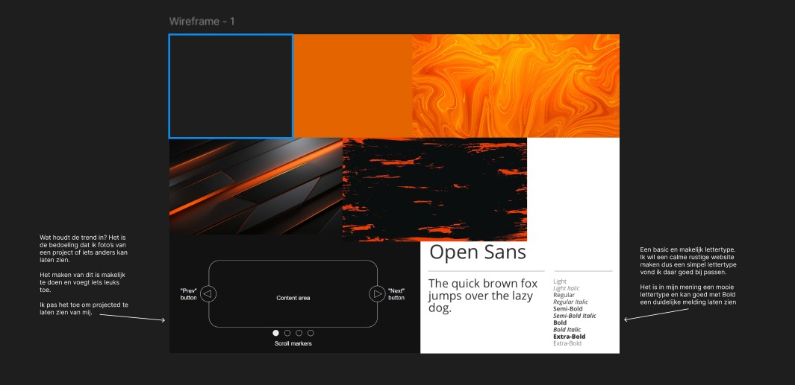
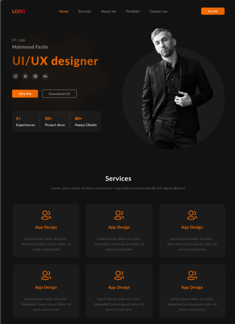
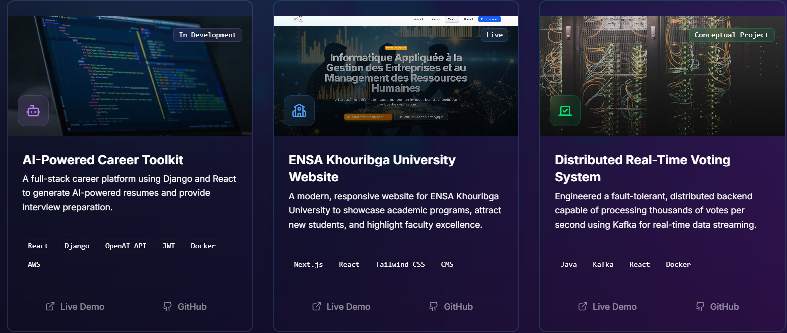

# Programma van Eisen – Persoonlijke Portfolio Website
## Inhoud
- [Inleiding](#inleiding)
- [Doelen van de website](#doelen-van-de-website)
- [Wensen en eisen van de opdrachtgever](#wensen-en-eisen-van-de-opdrachtgever)
- [Mijn eigen aanvullingen (must-haves)](#mijn-eigen-aanvullingen)
- [Technische voorwaarden](#technische-randvoorwaarden)
- [Conclusie](#conclusie)

## Inleiding
Hallo mijn naam is Jason van Ark,
ik ga bezig met heb maken/designen van mijn eigen portfolio. Mijn werkgever is Adi Soerjaman.

## Doelen van de website
Het doel van het maken van mijn protfolio is om meer informatie over mezelf te geven, ook wil ik mijn projecten en wat ik al kan laten zien.

## Wensen en eisen van de opdrachtgever
- Iets over jezelf (een korte introductie of “over mij”-stukje).

- Een overzicht van projecten (of projecten die nog in de toekomst komen).

- Per project een eigen plek met meer informatie.

- Een contactgedeelte (mag een aparte pagina zijn, of onderdeel van een andere pagina).

- De site moet responsive zijn (goed werken op mobiel, tablet en desktop).

- De website moet een persoonlijke touch hebben (stijl, kleuren, vormgeving die bij jou past).

## Mijn eigen aanvullingen
- een overzichtelijke navigatie.
- knoppen op een logische plek.
- 1 soort stijl aanhouden.
- alles netjes staat.

## Technische randvoorwaarden
- HTML, css
- Javascrip
- Tailwind

## Conclusie
Dit PvE vormt de basis voor mijn portfolio-website. Ik combineer de eisen van mijn werkgever met de eisen van mijzelf. Het doel is om de portfolie ook voor later te kunnen gebruiken en steeds mooier/uitegebreider te maken.

## Moodboard

Ik heb deze kleuren en stijl gekozen omdat mijn favoriete kleur oranje is. De kleur die ik het mooist vind bij oranje is zwart. Die stijl vind ik al mooi sinds mijn kindertijd.

Dit design is waar ik me het meest aan faan houden de donkere achtergrond en lichetere tekst.

Ik wil het liefst een carousel met al mijn projecten maar als dat niet lukt zou ik het graag in cards willen doen.