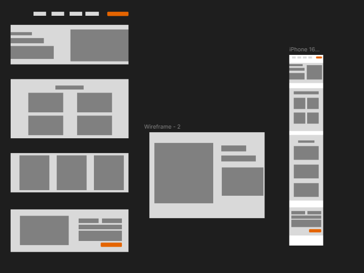

## Wireframe
Bij het maken van mijn wireframe heb ik goed gekeken wat ik had opgreschreven in mijn PvE en zo goed mogelijk na proberen te maken in figma zo heb ik mijn carousel op het 3rde kopje en als je op een project klikt ga je naar de losse middelste pagina waar je het project dan kan zien, daarnaast heb ik ook een contact gedeelte onderin. Ik wou de responsive versie(telefoon) vooral netjes en niet te moeilijk maken dus heb ik alles iets kleiner gemaakt en wat grotere dinge op ed website onder elkaar gezet op de telefoon versie.